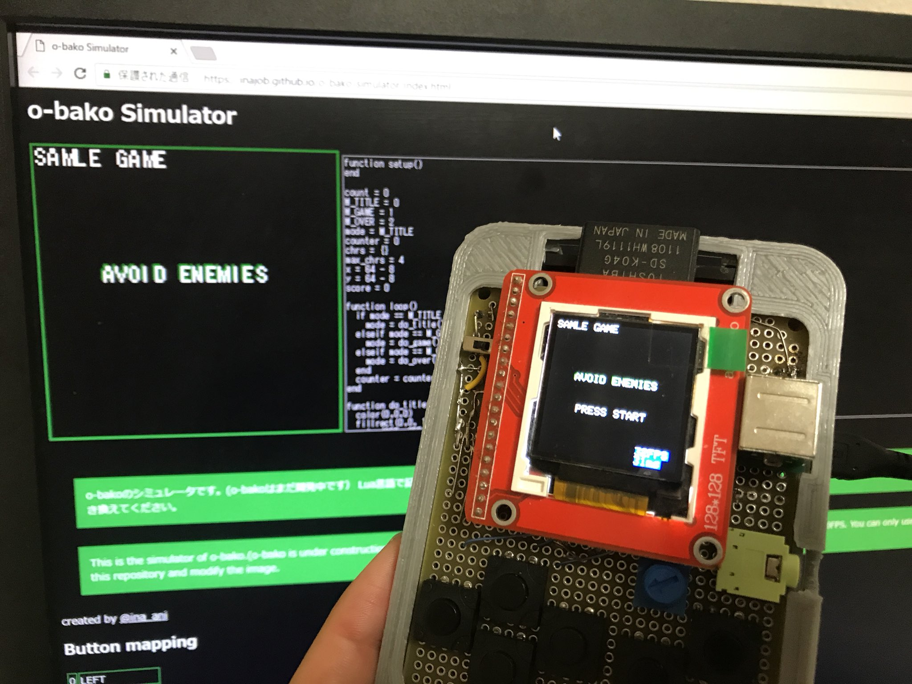

# o-bako Simulator

o-bako のシミュレータです。
ブラウザで動作します。

o-bakoは複数種類の言語で動作するように設計を模索しています

- Lua 版
  - https://inajob.github.io/o-bako-simulator/index.html
- JavaScript 版
  - https://inajob.github.io/o-bako-simulator/js.html
- AssemblyScript 版
  - https://inajob.github.io/o-bako-simulator/as.html

- Luaの実行のために https://fengari.io/ を利用しています。
- JavaScriptの実行のために https://github.com/svaarala/duktape を利用しています 
- エディタのために https://ace.c9.io/ を利用しています。
